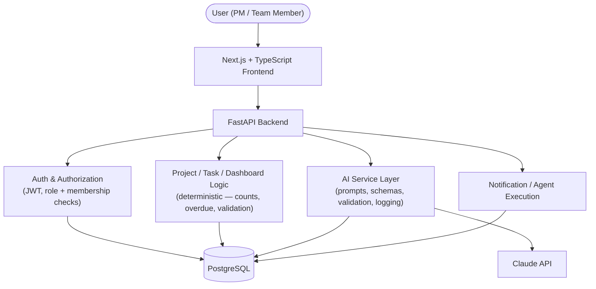

# AI Project Management Tool

A small Jira/Asana-style project management app with two real AI capabilities built directly
into the product workflow — not a chatbot bolted on the side.

Built as a 3-day GenAI/Agentic AI assessment project. See [CLAUDE.md](CLAUDE.md) for the full
spec this implementation follows.

## Problem Statement

Project Managers need to turn a vague requirement into a real, actionable task list, and need a
fast, trustworthy read on whether a project is healthy — without manually re-reading every task.
This tool does both, using an LLM that only ever reasons over facts pulled from the project's own
database, never on data it invents.

## Features

- **Projects & Tasks** — full CRUD, role-based authorization, project membership.
- **Kanban Task Board** — 4 columns (`To Do → In Progress → Testing → Completed`), drag-and-drop
  with optimistic UI and automatic revert on a failed save.
- **Dashboard** — total/completed/in-progress/delayed/due-this-week counts, computed with plain
  SQL/Python, never by the AI.
- **AI Requirement → Tasks** — a PM describes a requirement in plain language; Claude returns a
  structured, validated list of task suggestions the PM reviews, edits, and approves individually
  or all at once before anything is written to the database.
- **AI Project Health Analysis** — Claude reasons over objective facts (task counts, overdue
  items, priorities) computed from the database, and every risk it reports must cite a real task
  from the project. Risks that aren't grounded in real data are filtered out server-side.
- **Agentic workflow** — a PM can ask, in plain language, for a bulk change (e.g. "move overdue
  high-priority tasks to tomorrow"). The agent proposes specific, validated changes; nothing is
  persisted until the PM explicitly approves. Rejecting leaves the database untouched.
- **Notifications** — task assignment, AI-approved tasks, and executed agentic actions.
- **AI observability** — every AI call is logged (workflow type, timing, model, token usage,
  success/validation result) in `ai_logs`.

## Tech Stack

| Layer      | Choice                                                              |
| ---------- | -------------------------------------------------------------------- |
| Frontend   | Next.js (App Router) + TypeScript + React + Tailwind CSS            |
| Backend    | Python + FastAPI + Pydantic v2 + SQLAlchemy 2.0 + Alembic            |
| Database   | PostgreSQL (via Docker Compose)                                     |
| AI         | Anthropic Claude API (`claude-opus-5`), backend-only                |
| Auth       | JWT (bearer token), bcrypt password hashing                          |
| Testing    | pytest (backend, against a real Postgres test DB) + tsc/eslint/build |

**Why this stack:** Next.js/TypeScript and FastAPI/Pydantic are the mandated stack for this
assessment. PostgreSQL is the persistent source of truth — no in-memory or JSON-file storage.
SQLAlchemy (sync) + Alembic keep the data layer simple and explainable rather than adding async
complexity with no real performance need at this scale. JWT-in-header auth avoids cross-port
cookie/CORS complications between the Next.js dev server (3000) and FastAPI (8000).

## Architecture



**Deterministic vs. AI reasoning:** task counts, overdue/due-this-week calculations, completion
percentages, permission checks, and all database writes are plain backend logic — never delegated
to the AI (see CLAUDE.md §12). The AI is used only where language understanding adds real value:
breaking a requirement into tasks, reasoning about project health from given facts, and planning
an agentic proposal from a bounded set of candidate tasks.

### AI grounding, in one picture

```
PostgreSQL → backend computes objective facts → backend builds a bounded, structured
context → Claude reasons over that context only → backend validates Claude's response
(schema + grounding checks) → frontend displays the result
```

Concretely: `project_health` filters out any risk whose evidence text doesn't reference a real
task in the project (see `analyze_project_health` in `backend/app/ai/service.py`), and
`agent_planning` discards any proposed change referencing a `task_id` or `owner_id` that isn't in
the candidate list the backend actually sent Claude (see `propose_agent_action`).

## Database

```
users                  — id, email, password_hash, name, role (PM | MEMBER)
projects               — id, name, description, start_date, end_date, created_by
project_members        — project_id, user_id (join table)
tasks                  — id, project_id, title, owner_id, priority, status, start_date, due_date
task_dependencies       — task_id, depends_on_task_id
notifications           — user_id, message, type, is_read
ai_suggestion_batches   — one row per requirement submission
ai_suggestions          — individual AI-proposed tasks awaiting PM review/approval
ai_actions              — agentic proposals (proposed → approved/rejected → executed)
ai_logs                 — one row per AI provider call (timing, model, tokens, success)
```

All foreign keys, uniqueness constraints (e.g. one membership per user per project), and cascades
are enforced at the database level. Migrations are managed with Alembic
(`backend/migrations/versions/`).

## AI Workflows

### 1. Requirement → Tasks

```
PM enters requirement → Claude (structured output, Pydantic-validated) → AI suggestion batch
saved to DB as PENDING suggestions → PM edits/removes suggestions → PM approves individually
or in bulk → approved suggestions become real Task rows
```

The AI is asked for title, description, priority, suggested owner *role* (never a specific
person), estimated effort, dependencies, and acceptance criteria. The PM supplies the actual
owner and dates on approval — the AI never invents who a task belongs to or when it's due.

### 2. Project Health Analysis

```
Backend computes objective facts (total/completed/overdue/high-priority-overdue etc.) from the
DB → backend builds a task listing → Claude analyzes only that data → backend strips any risk
that doesn't cite a real task → frontend shows health rating + risks + recommendations +
the objective facts used
```

### 3. Agentic Workflow (stretch goal)

```
PM describes a change in plain language → backend hands Claude the full candidate task list for
that project (its only "tool access") → Claude proposes specific field changes + impacted users
→ backend discards any change referencing a task/user outside that candidate list → proposal
shown to PM → PM approves or rejects → only on approval: changes are persisted, notifications
are created, and the action is logged as EXECUTED
```

Rejecting a proposal makes zero database changes — verified by
`test_agent_reject_makes_no_changes` in the backend test suite.

## Folder Structure

```
frontend/               Next.js app (App Router)
  src/app/               routes: login, dashboard, projects, project detail, board, task detail, assistant
  src/components/        shared UI + page-level client components
  src/context/           AuthContext (JWT session)
  src/lib/                api-client.ts (fetch wrapper)
  src/types/              TypeScript types mirroring backend schemas

backend/
  app/api/routes/        auth, users, projects, tasks, dashboard, ai, notifications
  app/models/             SQLAlchemy models
  app/schemas/            Pydantic request/response schemas
  app/ai/                 client.py (Anthropic wrapper), service.py, prompts/, schemas.py
  app/services/           deterministic stats logic
  app/core/               config, database, security (JWT/bcrypt)
  app/seed.py             demo data
  migrations/              Alembic migrations
  tests/                   pytest suite (auth, authorization, CRUD, dashboard, AI workflows)

docker-compose.yml         PostgreSQL only — app processes run natively
.env.example
```

## Environment Setup

Copy the example env file and fill in your own Anthropic API key:

```bash
cp .env.example backend/.env
# edit backend/.env and set ANTHROPIC_API_KEY
```

The Anthropic key stays backend-only — it is never sent to or read by the browser.

## Database Setup

PostgreSQL runs via Docker Compose. **Note:** this project maps the container to host port
**5433** (not the default 5432) to avoid colliding with any native PostgreSQL install already
running on your machine — check `docker-compose.yml` / `.env.example` if you need to change it.

```bash
docker compose up -d postgres
```

The container's init script also creates a second database, `ai_pm_tool_test`, used by the
pytest suite so tests run against real Postgres rather than a mock.

## Migrations

```bash
cd backend
python -m venv venv
./venv/Scripts/activate        # venv\Scripts\activate on Windows cmd, or source venv/bin/activate on macOS/Linux
pip install -r requirements.txt
alembic upgrade head
python -m app.seed             # loads demo data (safe to re-run)
```

## Backend Setup

```bash
cd backend
uvicorn app.main:app --reload --port 8000
```

API docs: http://localhost:8000/docs

## Frontend Setup

```bash
cd frontend
npm install
npm run dev
```

App: http://localhost:3000

## Running Tests

```bash
cd backend
pytest -v
```

```bash
cd frontend
npx tsc --noEmit
npx eslint .
npm run build
```

## Demo Credentials

All seeded users share the password `password123`.

| Email               | Role              |
| ------------------- | ----------------- |
| alice@demo.com       | Project Manager   |
| bob@demo.com          | Project Manager   |
| carol@demo.com        | Team Member       |
| david@demo.com        | Team Member       |
| priya@demo.com        | Team Member       |

Seed data (`backend/app/seed.py`) includes three projects — one with zero tasks (empty-project
edge case) — with tasks spanning all four statuses, several overdue tasks, high-priority overdue
tasks, tasks due this week, and a completed task whose due date is in the past (to verify it's
counted as *completed*, not *delayed*).

## Demo Scenarios

1. **Login** as `alice@demo.com` (PM).
2. **Dashboard** — see real totals/completed/in-progress/delayed/due-this-week counts.
3. **Project → E-Commerce Checkout Revamp** — team, progress, task stats.
4. **Task Board** — drag a task between columns; refresh the page to confirm it persisted.
5. **AI Assistant → Requirement → Tasks** — enter *"Build customer registration with email OTP
   and forgot password functionality."*, review the generated suggestions, edit one, remove one,
   approve the rest — confirm real tasks now exist on the board.
6. **AI Assistant → Project Health** (on the project detail page) — generate an analysis; confirm
   the risks reference real, named tasks from the seed data (e.g. the overdue "Payment API
   integration" task).
7. **AI Assistant → Agentic Actions** — request *"Move all overdue high-priority tasks to
   tomorrow."*; **reject** the proposal and confirm nothing changed; run it again and **approve**
   it; confirm the task due dates updated and a notification appears.
8. **Log in as a Team Member** (`carol@demo.com`) — confirm they only see their own projects,
   can update the status of tasks they own, and get a 403 attempting to edit a task they don't
   own or a project they're not a member of.

## Known Limitations

- Task dependencies exist as a schema/API concept (`task_dependencies` table, `RawTaskSuggestion.
  dependencies`) but the frontend does not yet expose a dependency picker in the task-creation UI.
- No automated frontend component tests (Jest/RTL) were added given the 3-day scope; correctness
  is covered by `tsc`, `eslint`, `next build`, and manual QA against the running app. Backend
  logic — including all three AI workflows — has full pytest coverage.
- No end-to-end (Playwright) test suite; manual QA covered the PM and Team Member journeys.
- JWT is stored in `localStorage` rather than an httpOnly cookie, a deliberate simplicity
  trade-off for a prototype running frontend and backend on separate ports in dev (see
  Architecture Decisions in the implementation plan).
- "Due this week" is defined as the calendar week (Monday–Sunday) containing today's date.
